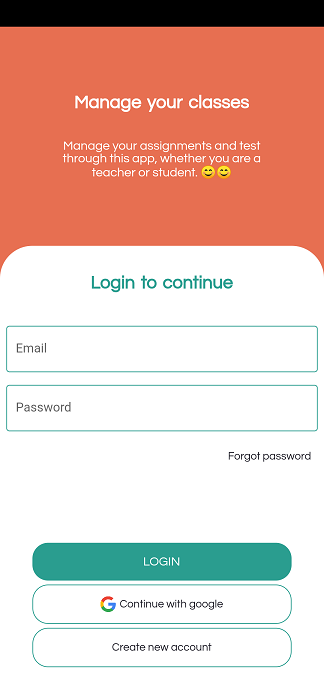
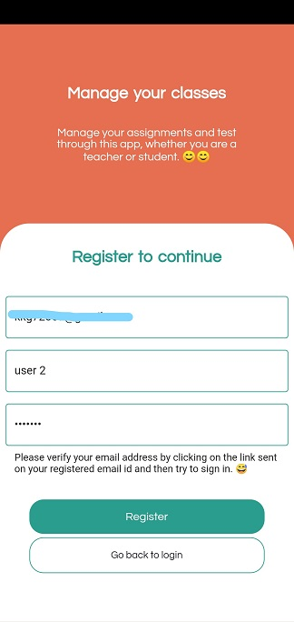
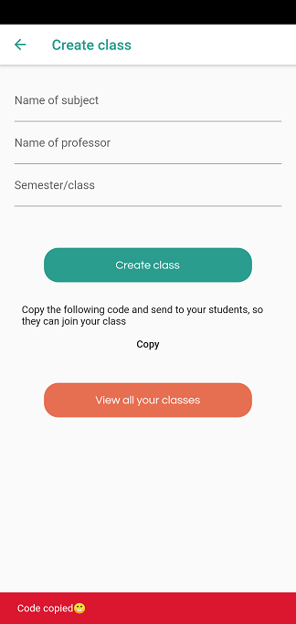
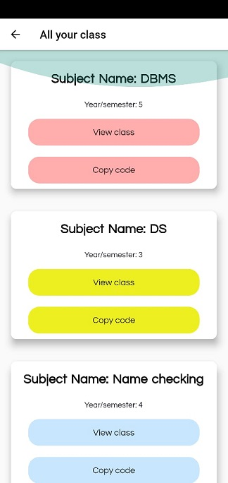

# classroom

## An app that let's you manage your classes, whether you are a teacher or student

## ✅ Robust User Authentication
### The user is greeted with the following screen on the app's first launch, in later user the user's authentication state is preserved.
The user can choose to login with email and password or with Google sign in.

A non registered will have to register at the following screen. In case of registration with email, the email will have to be verified through a link

    
Passwords can be resent using the forgot password button, the password will be reset through the verified email

## ✅ Home page
The home page UI allows the teacher to both manage the classes user is teaching in or studying in, along with displaying user's information.

# 👩‍🎓👨‍🎓 Student's section

## ✅ Joining class
The student can join by entering the code provided by teacher, app will generate a unique but intuitive code for each class.

  
The user may enter wrong code while joining a class or try to join again, these cases are covered.

    
 
The app will also mock you with two laughing emoticons if you try to enroll in a class that was created by you. Which I think is a stupid mistake. 😂😂

The app will greet you with following msg on successfull class joining.

## ✅ Managing classes
 
Student's will have this list of classes from where they can view and manage all the classes they are a part of

 
 
 
The students as well as teacher can make announcement in the class wall.The students can open the notes and assignment link provided by teacher, link provided here are dummy links, hence the error msg. The lectures scheduled by teacher will also be shown where they can open the meeting url provided by teacher.

# 👩‍🏫👨‍🏫 Teacher's section

## ✅ Managing classes
Teacher will have all the class management privileges the student had, along with that teacher can also view all the students in the class and mail them individually from within the app

## ✅ Creating classes
Teacher can create a class by providing following details, and once the class is created the teacher will be provided with the unique class code.
 
 

## Teacher will also be provided with a class list of all the classes
 
